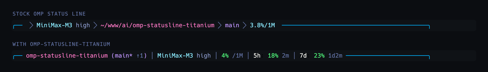
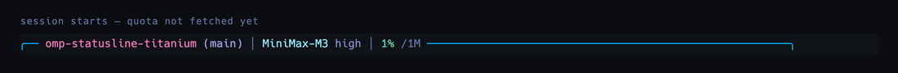

# omp-statusline-titanium

Status line extension for [omp (Oh My Pi)](https://github.com/can1357/oh-my-pi).

It repaints the built-in status line segments while the target theme is active, and adds
two readouts the stock bar does not have: **git divergence from the remote** and the
**MiniMax Token Plan quota**.

## What it changes



The top row is omp straight after installation: default `titanium` theme, `unicode` symbol
preset and the `default` status line, after a couple of turns so the cost segment has
something to show. The bottom row is the same session with this extension loaded on top of
the `titanium-dracula` theme and the `nerd` preset.

Which segments appear is a `statusLine` setting, not something the extension decides — it
restyles the segments you already enabled and fills the usage one for MiniMax plans.

| Segment | omp as installed | With this extension |
|---|---|---|
| `path` | Full path behind a folder glyph | Current directory only, highlighted |
| `git` | Branch name | Branch plus dirty marker and ahead/behind against the remote (`main* ↑2 ↓1`) |
| `context_pct` | `4.5%/1M` | `4% /1M`, colored by band — warning at 40%, error at 60% |
| `usage` | Not rendered for MiniMax | `4h: 3% 1h35m │ 7d: 29% 1h35m` — plan quota with time to reset |
| `cost` | `$0.02` for the session | Untouched — dropped from the bottom row by configuration, not by this extension |

### Live



Captured frame by frame from a real session: the quota lands a moment after start, the
context percentage climbs as turns run, a local commit shows up as `main* ↑1`, and the
branch falls back in sync once the commit is undone.

Each patch keeps the original renderer behind a `Symbol.for`, so reloading the extension
never stacks layers on top of itself.

## Install

```bash
git clone https://github.com/everton-dgn/omp-statusline-titanium.git
omp plugin link ./omp-statusline-titanium
```

Remove it with `omp plugin uninstall omp-statusline-titanium`.

## Configuration

The patches only apply while the active theme matches the target, which defaults to
`titanium-dracula`. Point it at your own theme with:

```bash
export OMP_STATUSLINE_THEME="your-theme"
```

The `titanium-dracula` theme lives in
[everton-dgn/omp-theme-titanium-dracula](https://github.com/everton-dgn/omp-theme-titanium-dracula)
and is also proposed as a built-in omp theme in
[PR #6651](https://github.com/can1357/oh-my-pi/pull/6651):

```bash
mkdir -p ~/.omp/agent/themes
curl -fsSL -o ~/.omp/agent/themes/titanium-dracula.json \
  https://raw.githubusercontent.com/everton-dgn/omp-theme-titanium-dracula/main/titanium-dracula.json
omp config set theme.dark titanium-dracula
```

### MiniMax quota

`omp usage` reports the MiniMax Token Plan quota natively since 17.1.4
([PR #6650](https://github.com/can1357/oh-my-pi/pull/6650)), so the readout reuses those
reports instead of calling the endpoint itself: it reads `AuthStorage.fetchUsageReports()`
through `ctx.modelRegistry`, keeps the plan-wide (`shared`) buckets of the `minimax-code`
provider, and renders the rolling and weekly windows. Credentials, caching and retries stay
with omp.

The status line still needs the extension for it. Core keys the segment on the active
model's provider (`minimax` for `minimax/MiniMax-M3`) while the report arrives under
`minimax-code`, and it only maps the `5h` and `7d` window ids — MiniMax reports the span it
actually rolls on (`4h` here), so the rolling window has no native slot. With no MiniMax
report available, the segment falls back to whatever core provides.

## Thresholds

Declared at the top of `src/status-line-style.js`:

| Constant | Default |
|---|---|
| `BRANCH_MAX_LENGTH` | 18 characters |
| `CONTEXT_WARNING_THRESHOLD` / `CONTEXT_ERROR_THRESHOLD` | 40% / 60% |
| `USAGE_WARNING_THRESHOLD` / `USAGE_ERROR_THRESHOLD` | 70% / 85% |
| `MINIMAX_REFRESH_INTERVAL_MS` | 60 s |
| `GIT_DIVERGENCE_REFRESH_INTERVAL_MS` | 30 s |

## License

MIT
